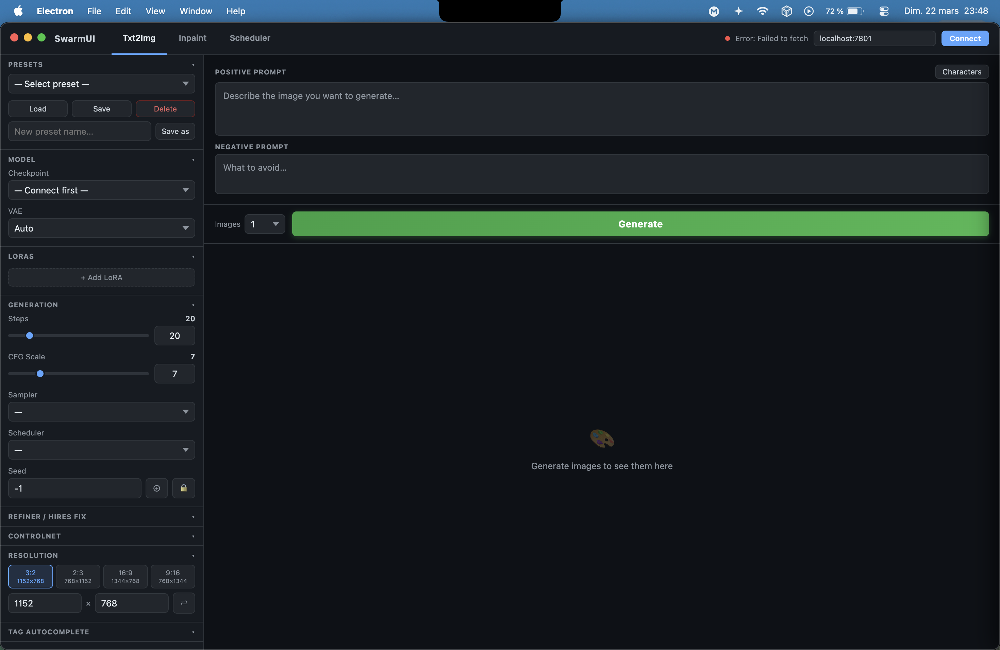
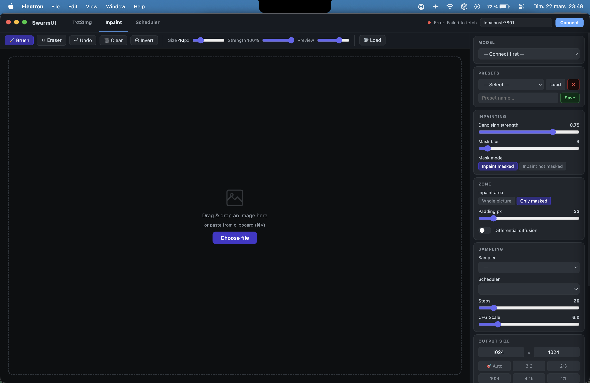
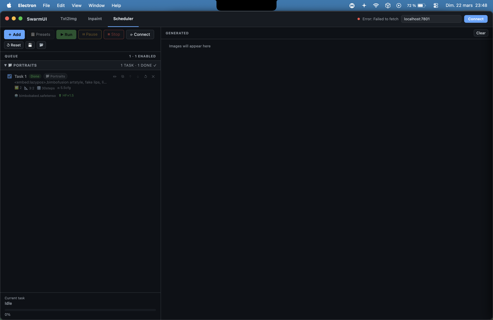

# SwarmUI App

A native Electron frontend for [SwarmUI](https://github.com/mcmonkeyprojects/SwarmUI) with a clean dark UI.

## Screenshots





## Features

- **Txt2Img** — Generate images with sampler, scheduler, LoRA, VAE, Hires Fix, ControlNet
- **Inpaint** — Canvas-based inpainting with Only Masked / Whole Picture modes, Differential Diffusion (soft inpainting), brush strength
- **Scheduler** — Task queue to run multiple generations unattended, with ControlNet and Hires Fix per task, gallery with group navigation
- **Character Selector** — Browse and insert character embeddings from a local dataset
- **Tag Autocomplete** — Danbooru tag suggestions while typing
- **Local presets** — Saved entirely in localStorage, no server dependency

## Requirements

- [Node.js](https://nodejs.org/) 18+
- [SwarmUI](https://github.com/mcmonkeyprojects/SwarmUI) running locally or on your network

## Install & Run

```bash
git clone https://github.com/your-username/swarmui-app.git
cd swarmui-app
npm install
npm start
```

## Configuration

### SwarmUI host

In the top bar, set your SwarmUI address (default: `localhost:7801`) and click **Connect**.

Your host is saved automatically in localStorage between sessions.

### Character Selector data (optional)

The Character Selector requires a local data folder containing these files:

| File | Description |
|------|-------------|
| `wai_characters.csv` | Character list (name, series) |
| `wai_character_thumbs.json` | Compressed thumbnails |
| `wai_tag_assist.json` | Tag suggestions per character |

These files come from the [wai-ani-illustrious-character](https://github.com/waifu-diffusion/waifu-ani-illustrious) dataset or similar.

On first open of the Character Selector panel, click **Choose folder…** to point the app to your data directory. The path is saved permanently in your OS user data folder.

You can also change it later via the 📂 icon in the Character Selector header.

## Build a distributable

```bash
# macOS (.dmg)
npm run build:mac

# Windows (.exe installer)
npm run build:win

# Linux (.AppImage)
npm run build:linux
```

Output goes to the `dist/` folder.

## License

MIT
